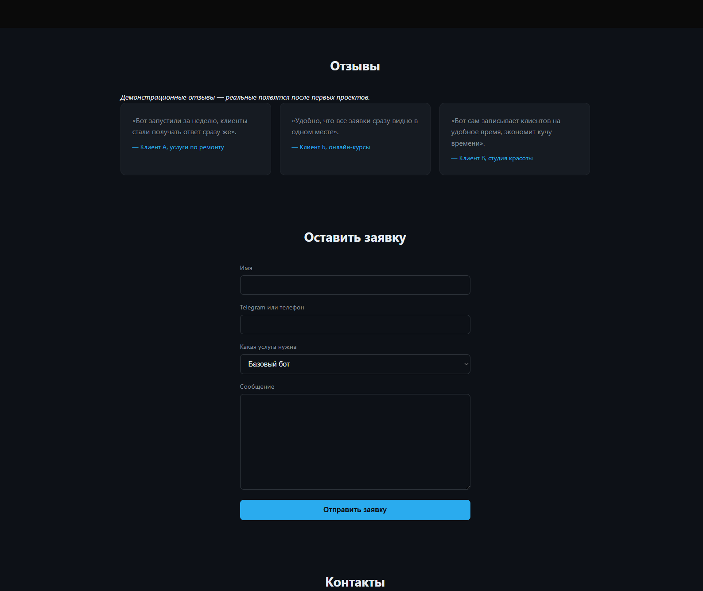
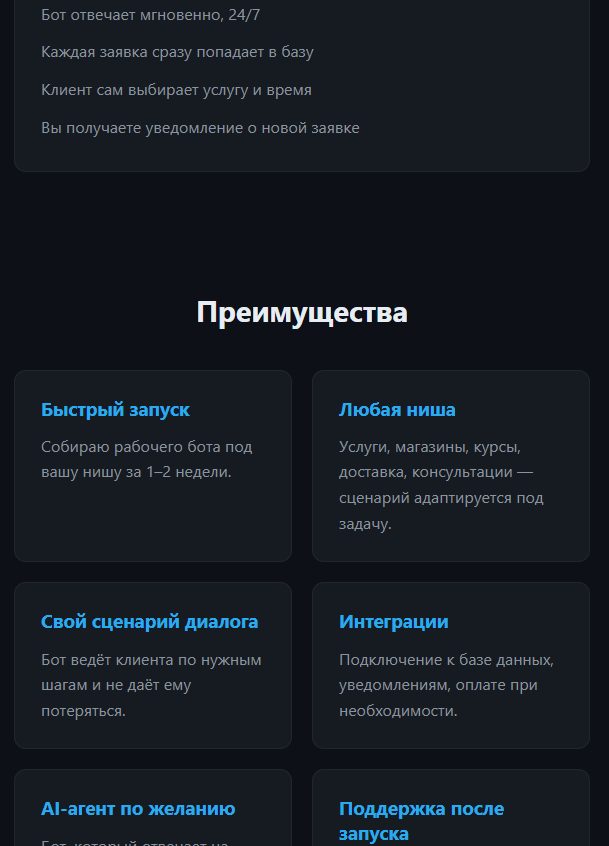

# Django Business Landing (BotForge)

Учебный проект: лендинг на Django для продвижения услуг по разработке Telegram-ботов и AI-агентов. Посетитель оставляет заявку через форму — она сохраняется в базе данных и появляется в панели администратора.

## Функции

- Адаптивный лендинг (десктоп и мобильные экраны от 375px).
- Форма заявки с выбором услуги, сохранением в базу данных и защитой от пустой отправки.
- Django Admin: список заявок с фильтром по статусу и услуге, поиском по имени/контакту, изменением статуса без захода в карточку.
- Секретный ключ и настройки — через переменные окружения, не в коде.

## Технологии

- Python, Django 6.0
- SQLite
- HTML, CSS (без JavaScript и сторонних фреймворков)

## Локальный запуск

```bash
python -m venv venv
venv\Scripts\activate
pip install -r requirements.txt
```

Скопируй `.env.example` в `.env` и подставь свой `SECRET_KEY` (его можно сгенерировать командой ниже):

```bash
copy .env.example .env
python -c "from django.core.management.utils import get_random_secret_key; print(get_random_secret_key())"
```

Дальше:

```bash
python manage.py migrate
python manage.py createsuperuser
python manage.py runserver
```

Сайт: http://127.0.0.1:8000/
Админка: http://127.0.0.1:8000/admin/

## Переменные окружения

Файл `.env` (не публикуется в Git, пример — в `.env.example`):

| Переменная | Назначение |
|---|---|
| `SECRET_KEY` | Секретный ключ Django, свой для каждой установки |
| `DEBUG` | `True` для разработки, `False` для продакшена |

## Скриншоты

**Десктоп**


**Мобильная версия**




## Ссылка на демонстрацию

Пока не опубликовано — сайт запускается только локально.

## Планы по улучшению

- Смена языка интерфейса (русский/английский/польский).
- Более яркое оформление и лёгкие CSS-анимации.
- Валидация телефона с выбором кода страны.
- Telegram-уведомление о новой заявке.
- Публикация на хостинге.
